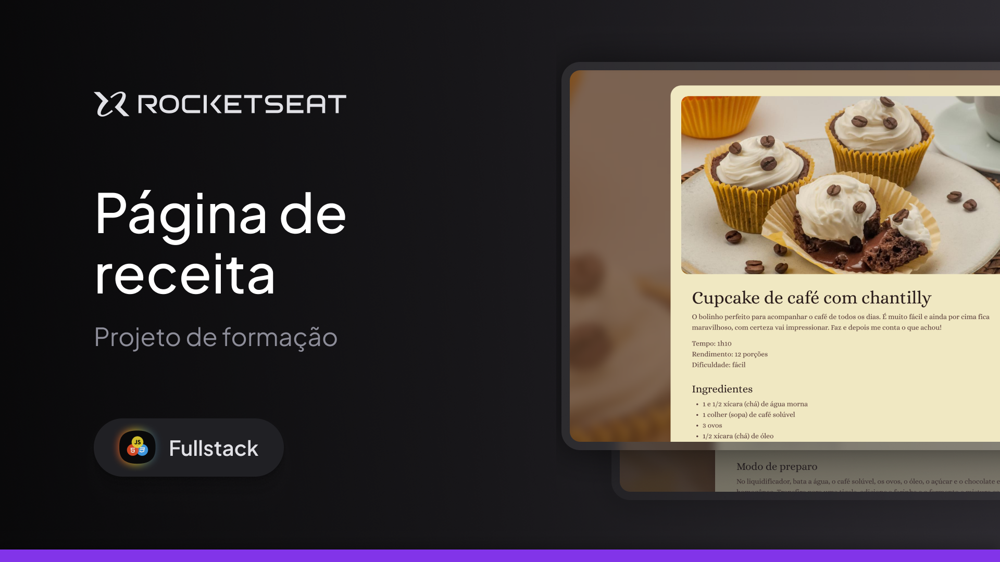

 
# NOME DO PROJETO | NAME THIS PROJECT | NOMBRE DEL PROYECTO

### Página de Receita | Recipe Page | Página de la Receta

## DESCRIÇÃO | DESCRIPTION | DESCRIPCIÓN

Este é um pequeno exemplo de página de receita de Cupcake de Café com Chantilly usando HTML e CSS.  
This is a small example of a Coffee and Whipped Cream Cupcake recipe page using HTML and CSS.  
Este es un pequeño ejemplo de una página de recetas de Cupcakes de Café y Nata Montada utilizando HTML y CSS.

🉠😠:)

